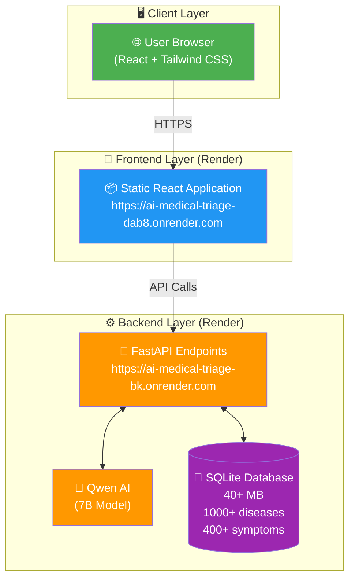
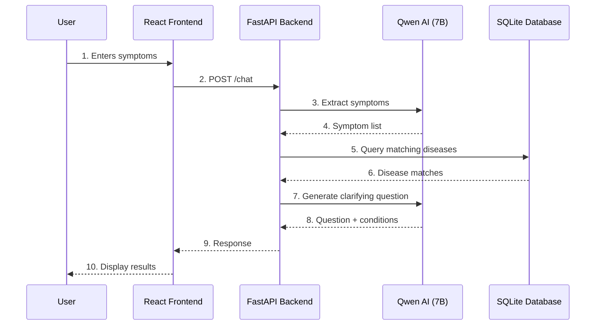
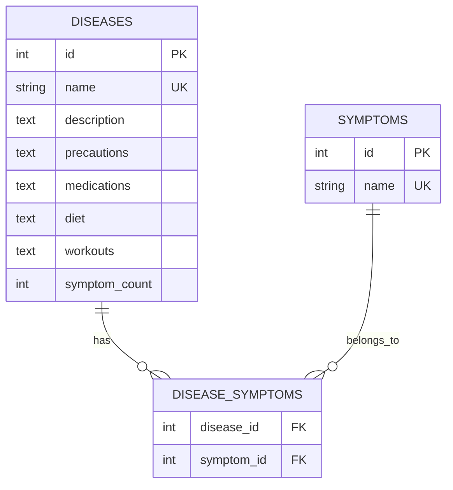
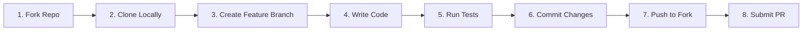

# 🏥 AI Medical Triage

> **Privacy-first, open-source conversational AI for initial medical triage**

<div align="center">

[](https://ai-medical-triage-dab8.onrender.com)
[](https://ai-medical-triage-bk.onrender.com)
[](https://opensource.org/licenses/MIT)
[](http://makeapullrequest.com)
[](https://github.com/0xProgress/AI-Medical-Triage)

</div>

---

## 🌟 Overview

AI Medical Triage is a **privacy-first, open-source** conversational AI system that helps users understand their symptoms and identify potential conditions before seeking professional medical care. Built with **Qwen AI** and a comprehensive medical database, it provides intelligent, multi-turn conversations to narrow down possible conditions and generate downloadable health reports.

### ✨ Key Features

<div align="center">

| Feature | Description |
|---------|-------------|
| 💬 **Multi-turn Conversational AI** | Smart clarifying questions to narrow down conditions |
| 🏥 **Evidence-Based Matching** | Symptoms matched against 1,000+ diseases and 400+ symptoms |
| 📄 **Downloadable Health Reports** | Users own their health data with PDF reports |
| 🔒 **Privacy First** | Zero server-side data logging, sessions auto-delete |
| 🌍 **Open Source** | Fully auditable code, deployable anywhere |
| 🚨 **Red Flag Alerts** | Immediate warnings for life-threatening symptoms |

</div>

---

## 🌐 Live Demo

| Service | URL | Status |
|---------|-----|--------|
| 🖥️ **Frontend** | [ai-medical-triage-dab8.onrender.com](https://ai-medical-triage-dab8.onrender.com) |  |
| 🔗 **Backend API** | [ai-medical-triage-bk.onrender.com](https://ai-medical-triage-bk.onrender.com) |  |
| 📚 **API Docs** | [ai-medical-triage-bk.onrender.com/docs](https://ai-medical-triage-bk.onrender.com/docs) |  |

---

## 📋 Table of Contents

- [Architecture](#-architecture)
- [Technology Stack](#-technology-stack)
- [Quick Start](#-quick-start)
- [Deployment](#-deployment)
- [API Reference](#-api-reference)
- [Database Schema](#-database-schema)
- [Contributing](#-contributing)
- [Known Issues](#-known-issues)
- [License](#-license)

---

## 🏗 Architecture

### System Architecture



### Data Flow



---

## 🛠 Technology Stack

### Full Stack Overview

```mermaid
flowchart TB
    subgraph FullStack["🏗️ Complete Technology Stack"]
        
        subgraph Frontend["🖥️ Frontend (React + TypeScript)"]
            F_React["⚛️ React 18"]
            F_TS["📝 TypeScript"]
            F_Tailwind["🎨 Tailwind CSS"]
            F_Vite["⚡ Vite"]
            F_Zustand["📦 Zustand"]
        end
        
        subgraph Backend["⚙️ Backend (Python + FastAPI)"]
            B_FastAPI["🚀 FastAPI"]
            B_Qwen["🧠 Qwen 2.5-7B"]
            B_SQLite["💾 SQLite"]
            B_Pandas["🐼 Pandas"]
            B_WeasyPrint["📄 WeasyPrint"]
        end
        
        subgraph DevOps["☁️ DevOps & Deployment"]
            D_Render["🔄 Render"]
            D_HF["🤗 Hugging Face"]
            D_GitHub["🐙 GitHub"]
        end
        
        Frontend -->|API Calls| Backend
        Backend -->|Deployed on| DevOps
        Frontend -->|Deployed on| DevOps
    end
    
    classDef frontend fill:#61DAFB,color:#000
    classDef backend fill:#FF6B6B,color:#fff
    classDef devops fill:#46E3B7,color:#000
    
    class F_React,F_TS,F_Tailwind,F_Vite,F_Zustand frontend
    class B_FastAPI,B_Qwen,B_SQLite,B_Pandas,B_WeasyPrint backend
    class D_Render,D_HF,D_GitHub devops
```



### Technology Details

<div align="center">

#### Frontend

| Technology | Version | Purpose |
|------------|---------|---------|
|  | 18.2.0 | UI Framework |
|  | 5.0.0 | Type Safety |
|  | 3.4.0 | Styling |
|  | 5.0.0 | Build Tool |
|  | 4.5.0 | State Management |

#### Backend

| Technology | Version | Purpose |
|------------|---------|---------|
|  | 0.104.1 | API Framework |
|  | 3.11 | Runtime |
|  | 3.45 | Database |
|  | 2.5-7B | AI Model |

</div>

---

## 🚀 Quick Start

### Prerequisites

```bash
# Required versions
Python >= 3.11
Node.js >= 18
Git
```

### Step 1: Clone the Repository

```bash
git clone https://github.com/0xProgress/AI-Medical-Triage.git
cd AI-Medical-Triage
```

### Step 2: Backend Setup

```bash
cd backend

# Create virtual environment
python -m venv venv
source venv/bin/activate  # On Windows: venv\Scripts\activate

# Install dependencies
pip install -r requirements.txt

# Build the database (first time only)
python -c "from database.build_db import DatabaseBuilder; DatabaseBuilder().build()"

# Run the server
uvicorn main:app --host 0.0.0.0 --port 8000 --reload
```

### Step 3: Frontend Setup

```bash
cd frontend

# Install dependencies
npm install

# Create environment file
echo "VITE_API_URL=http://localhost:8000/api/v1" > .env

# Run development server
npm run dev
```

### Step 4: Open in Browser

| Service | URL |
|---------|-----|
| 🖥️ **Frontend** | http://localhost:5173 |
| 🔗 **Backend API** | http://localhost:8000 |
| 📚 **API Docs** | http://localhost:8000/docs |

---

## 🚢 Deployment

### Backend (Render)

<details>
<summary>Click to expand backend deployment steps</summary>

1. Create a new Web Service on Render
2. Connect your GitHub repository
3. Configure:

| Setting | Value |
|---------|-------|
| **Environment** | Python 3 |
| **Build Command** | `pip install -r requirements.txt` |
| **Start Command** | `uvicorn main:app --host 0.0.0.0 --port 10000` |
| **Root Directory** | `backend` |

4. Add Environment Variables:

```env
PYTHON_VERSION=3.11.8
HF_HOME=/data
```
</details>

### Frontend (Render Static Site)

<details>
<summary>Click to expand frontend deployment steps</summary>

1. Create a new Static Site on Render
2. Connect your GitHub repository
3. Configure:

| Setting | Value |
|---------|-------|
| **Build Command** | `npm install && npm run build` |
| **Publish Directory** | `dist` |
| **Root Directory** | `frontend` |

4. Add Environment Variables:

```env
VITE_API_URL=https://your-backend-url.onrender.com/api/v1
```
</details>

### Hugging Face Spaces (Alternative)

```bash
# Clone the Space
git clone https://huggingface.co/spaces/your-username/medtriage-frontend

# Copy built files
cp -r frontend/dist/* medtriage-frontend/

# Push
cd medtriage-frontend
git add .
git commit -m "Deploy"
git push
```

---

## 📚 API Reference

### Base URL

```
https://ai-medical-triage-bk.onrender.com/api/v1
```

### Endpoints

<details>
<summary>📌 Health Check</summary>

```http
GET /health
```

**Response:**
```json
{
  "status": "healthy",
  "version": "0.1.0",
  "timestamp": "2026-06-24T12:00:00"
}
```
</details>

<details>
<summary>💬 Chat</summary>

```http
POST /chat
```

**Request:**
```json
{
  "session_id": "optional-uuid",
  "message": "I have a cough and fever",
  "history": []
}
```

**Response:**
```json
{
  "session_id": "uuid",
  "message": "Based on your symptoms...",
  "conditions": [
    {
      "name": "acute bronchospasm",
      "description": "...",
      "match_score": 4,
      "match_percentage": 18.18,
      "urgency": "high",
      "precautions": ["..."],
      "medications": ["..."],
      "diet": ["..."],
      "workouts": ["..."]
    }
  ],
  "follow_up_question": "Is the cough productive or dry?",
  "red_flags": [],
  "is_complete": false,
  "turn": 1,
  "max_turns_reached": false
}
```
</details>

<details>
<summary>📄 Generate Report</summary>

```http
POST /report
```

**Request:**
```json
{
  "session_id": "your-session-id"
}
```

**Response:**
```json
{
  "report_url": "/downloads/report_xxxxx.pdf",
  "download_url": "/downloads/report_xxxxx.pdf",
  "generated_at": "2026-06-24T12:00:00"
}
```
</details>

<details>
<summary>🔍 Get Session</summary>

```http
GET /session/{session_id}
```
</details>

---

## 📊 Database Schema



### Tables

<details>
<summary>📋 Diseases Table</summary>

```sql
CREATE TABLE diseases (
    id INTEGER PRIMARY KEY,
    name TEXT UNIQUE,
    description TEXT,
    precautions TEXT,      -- JSON array
    medications TEXT,      -- JSON array
    diet TEXT,            -- JSON array
    workouts TEXT,        -- JSON array
    symptom_count INTEGER
);
```
</details>

<details>
<summary>📋 Symptoms Table</summary>

```sql
CREATE TABLE symptoms (
    id INTEGER PRIMARY KEY,
    name TEXT UNIQUE
);
```
</details>

<details>
<summary>📋 Disease-Symptoms Relationship</summary>

```sql
CREATE TABLE disease_symptoms (
    disease_id INTEGER,
    symptom_id INTEGER,
    PRIMARY KEY (disease_id, symptom_id),
    FOREIGN KEY (disease_id) REFERENCES diseases(id),
    FOREIGN KEY (symptom_id) REFERENCES symptoms(id)
);
```
</details>

---

## 🤝 Contributing

### Development Workflow



### Commit Convention

| Type | Description |
|------|-------------|
| `feat` | New feature |
| `fix` | Bug fix |
| `docs` | Documentation |
| `style` | Code style |
| `refactor` | Code refactoring |
| `test` | Testing |
| `chore` | Build/package updates |

### Coding Standards

- **Python**: PEP 8
- **TypeScript**: ESLint + Prettier
- **Commits**: Conventional Commits

---

## 🐛 Known Issues

### To Be Fixed

| Issue | Status | Priority |
|-------|--------|----------|
| Report download 404 | 🔴 | Medium |
| Environment variables hardcoded | 🟡 | High |
| Cold start delay (30-60s) | 🟡 | Medium |
| Database build on deploy (60s) | 🟢 | Low |
| Mobile responsiveness | 🟢 | Low |

---

## 📄 License

This project is licensed under the MIT License - see the [LICENSE](LICENSE) file for details.

---

## 🙏 Acknowledgments

- **Qwen Team** for the open-source AI model
- **Symcat** for the medical database
- **Hugging Face** for model hosting
- **Render** for free hosting

---

## 📞 Contact & Community

| Platform | Link |
|----------|------|
| 🐙 GitHub Issues | [Report a bug](https://github.com/0xProgress/AI-Medical-Triage/issues) |
| 📧 Email | [progressuwhuseba@gmail.com](mailto:progressuwhuseba@gmail.com) |

---

## ⚠️ Disclaimer

<div align="center">

> **🚨 This is NOT a substitute for professional medical advice.**
>
> Always consult a licensed healthcare provider for medical decisions. This tool is for informational purposes only and should not be used for self-diagnosis or treatment.
>
> **In case of emergency, call your local emergency number immediately.**

</div>

---

## 🌟 Support the Project

If you find this project helpful, please consider:

- ⭐ **Starring** the repository
- 🐛 **Reporting** issues
- 🔧 **Contributing** code
- 💰 **Sponsoring** development

---

<div align="center">

**Built with ❤️ for healthcare accessibility**

[⬆ Back to Top](#-ai-medical-triage)

</div>